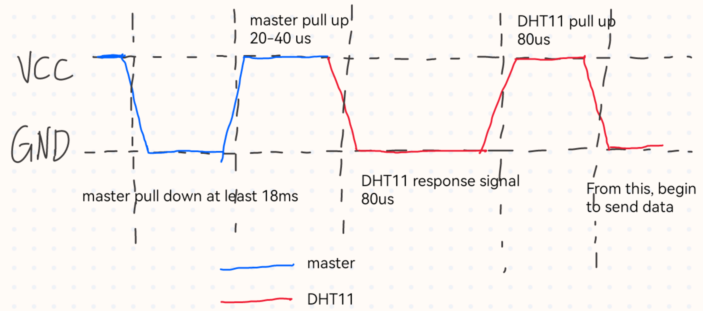
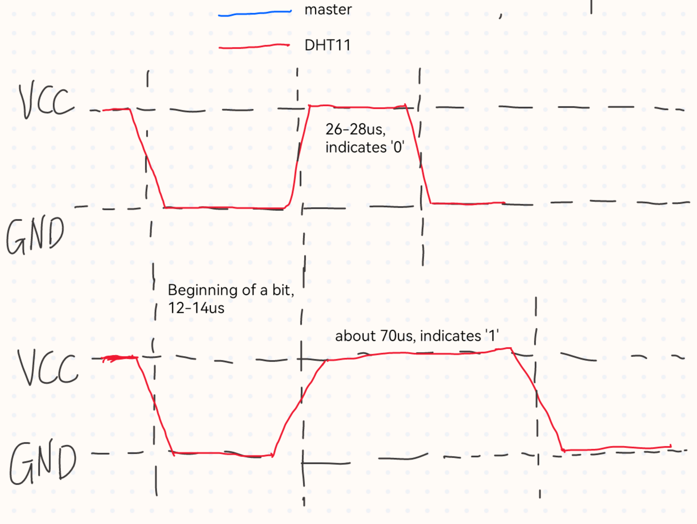
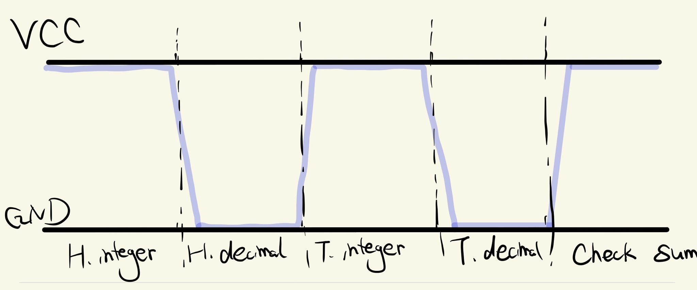

# DHT11 temperature and humidity sensor

## Pins

|Pin|Function|Connection|
|:-:|:------:|:--------:|
|VCC|Power supply|3.3V - 5V|
|GND|Ground|GND|
|DOUT|Data pin|GPIO|

**Note: Serial data, single bus.**

## Function
- uint8_t init(void\* args) : Initialize DHT11 module. Return 0 if succeed or 1 if faile.
- void reset(void) : Reset DHT11 and send a start signal to DTH11 module.
- uint8_t check(void) : Check whether DHT11 module works well. Return 0 if yes or 1 if no.
- uint8_t read_bit(void) : Read 1 bit from DHT11 module. Return 1 or 0.
- uint8_t read_byte(void) : Read 1 byte from DHT11 module. Return the data read from DHT11.
- uint8_t read_data(uint8_t\* buffer) : Read complete data from DHT11 module.
- string get_datastr(uint8_t\* buffer) : Get the string format data of temperature and humidity.
- static void* start(void\* args) : Could be the function pointer of a new thread.
- void test() : test the DHT11 module

## Sequence diagram

### **Begin signal of DHT11 module**

### **indication of bit '0' and '1' of DHT11 module**

## Data format

> The temperature and humidity data of DHT11 is expressed in binary digital. 
> Before sending one bit, DHT11 will pull down the DOUT pin for 50us.
> The complete data includes 40 bits (5 bytes). They are: **1 byte humidity integer part +
> 1 byte humidity decimal part + 1 byte temperature integer part + 1 byte temperature decimal part + 1 byte check sum.**

